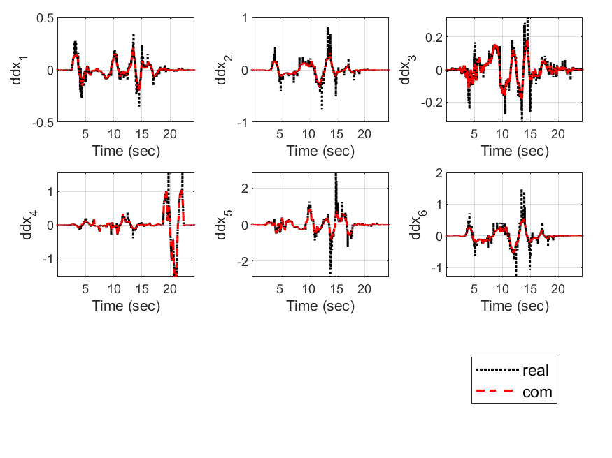

# Franka Emika Panda Matlab Simulation

This repository is a MATLAB simulation of franka emika panda robot control using Runge-Kutta. The robot manipulator dynamic model (M, C, G, F) uses the functions provided in [1]. The kinematic function matches the actual panda robot data. However, Jacobian's derivative and Jacobian have some errors.


## Function 
- real_data : Franka emika panda robot actual data files

- model : Franka emika panda robot model library folder

  + get_CoriolisMatrix.m : Coriolis matrix function  [1]
  + get_CoriolisVector.m : Coriolis vector function  [1] 
  + get_FrictionTorque.m : Friction torque function  [1]
  + get_GravityVector.m : Gravity vector function  [1]
  + get_MassMatrix.m : Inertia matrix function [1]
  + get_Jacobian_dot.m : Jacobian Differential Functions 
  + get_JacobianZ2YZ1.m :  Jacobian function  (direction z2-y-z1) 
  + get_pose.m :  kinematic function 
  + plant.m :  robot manipulator plant function 
  + simple_plant.m :  robot manipulator plant 함수 
  + rk.m /simple_rk.m :  Runge-Kutta 함수

- 0. test_model_kinematics.m : kinematics test code

- 0. test_model_jacobain.m : jacobian test Code

- 0. test_model_dot_jacobain.m : jacobian dot  test Code

- 1. main_cartesian_pd_control_playback.m : Cartesian PD controller code

- 1. main_impedance_control.m : Cartesian Impedance Controller Code

- 1. main_simple_pd_control_playback.m : Simple PD controller code

## Controller
- simple pd controller

 
- catesian pd controller

 
- position based impendace controller

 


 ## Kinematics Test

-  Franka Emika Robot DH parameters

|   i   |   1   |   2   |   3   |   4    |    5    |   6   |   7   |   8   |
| :---: | :---: | :---: | :---: | :----: | :-----: | :---: | :---: | :---: |
| theta |  q1   |  q2   |  q3   |   q4   |   q5    |  q6   |  q7   |   0   |
|   d   | 0.333 | 0.000 | 0.316 | 0.000  |  0.384  | 0.000 | 0.000 | 0.107 |
|   a   | 0.000 | 0.000 | 0.000 | 0.0825 | -0.0825 | 0.000 | 0.088 | 0.000 |
| alpha |   0   | -pi/2 | pi/2  |  pi/2  |  -pi/2  | pi/2  | pi/2  |   0   |

- Modified DH parameters


```matlab
Ti= cell(n,1); 
for j=1:n
    if(j == 1)
        Ti{j} = Rhx(alpha(j)) * Rt(a(j), 0, 0)  * Rhz(q(j)) * Rt(0,0,d(j));
    else
        Ti{j} = Ti{j-1}*Rhx(alpha(j)) * Rt(a(j), 0, 0)  * Rhz(q(j)) * Rt(0,0,d(j));
   end
end
p = Ti{n}(1:3,4);
R = Ti{n}(1:3,1:3);
```

- kinematics test plot

  


 ##  Jacobian Test

- Jacobian test plot

  > Cartesian derivative(real) :  
  >
  > - data1: 
  > - data2:
  > - data3:

- jacobain test plot

 

 

## jacobian derivative
- Jacobian derivative test plot

  > Cartesian second derivative(real) : 
  > - com: 

- jacobain dot test plot

 

 


> [1] *Gaz, Claudio, et al. "Dynamic identification of the* *franka* *emika* *panda robot with retrieval of feasible parameters using penalty-based optimization." IEEE Robotics and Automation Letters 4.4 (2019): 4147-4154.*
>
> (*https://github.com/marcocognetti/FrankaEmikaPandaDynModel*)
